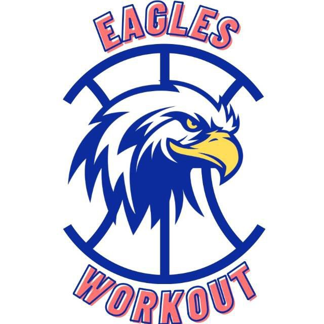

<div align="center">
  
  
  <h1>🏀 EAGLES Basketball Academy 🦅</h1>
  <p><b>Sistem Informasi & Pendaftaran Akademi Basket Privat Berbasis Web</b></p>

  <!-- Badges -->
  
  
  
  
  
</div>

<br>

## 📖 Tentang Project
**EAGLES Basketball Academy** adalah platform website responsif yang dirancang untuk kebutuhan informasi dan pendaftaran akademi basket. Dibangun menggunakan framework Laravel, website ini memudahkan calon siswa untuk melihat jadwal, pelatih, galeri, serta mendaftar secara online.

## ✨ Fitur Utama
- 🏀 **Beranda Dinamis**: Menampilkan keunggulan akademi dan program latihan.
- 📝 **Pendaftaran Online**: Formulir pendaftaran siswa baru yang terintegrasi.
- 🔐 **Dashboard Admin**: Mengelola data pendaftar, galeri, dan roster tim pelatih.
- 🤖 **AI Coach Widget**: Asisten virtual interaktif di pojok layar untuk membantu pengunjung.
- 📱 **Mobile Responsive**: Tampilan yang rapi saat diakses lewat HP maupun Laptop.

## 🚀 Cara Instalasi (Setup) di Local
Jika kamu ingin menjalankan project ini di komputermu sendiri, ikuti langkah berikut:

1. Clone repository ini:
   ```bash
   git clone [https://github.com/Fenzz885/nama-repo-kamu.git](https://github.com/UsernameGitHubKamu/nama-repo-kamu.git)